<p align="center">
  <a href="https://wintercounter.github.io/gridla/"></a>
</p>

<p align="center">
  Pixel-precise grids and nested layouts that move, resize, snap, and reflow.<br>
  A framework-neutral engine with an optional React adapter.
</p>

<p align="center">
  <a href="https://www.npmjs.com/package/gridla"></a>
  <a href="https://github.com/wintercounter/gridla/actions/workflows/ci.yml"></a>
  <a href="https://bundlephobia.com/package/gridla"></a>
  <a href="https://github.com/wintercounter/gridla/blob/main/LICENSE"></a>
  <a href="https://wintercounter.github.io/gridla/"></a>
</p>

<p align="center">
  
</p>

Gridla turns "the user dragged this box to (412, 96)" into a complete, valid
layout. It pushes, swaps, reorders, or shrinks neighbors to make room, keeps
fixed sizes and configured gaps intact, projects layouts onto any canvas size,
and does all of it with plain objects. No DOM in the core, no state library,
no drag-and-drop framework, zero runtime dependencies.

```sh
npm install gridla
```

## In sixty seconds

```ts
import { createItem, moveItem, projectLayout } from 'gridla'

const layout = {
  canvas: {
    width: 960,
    height: 600,
    padding: { top: 0, right: 0, bottom: 0, left: 0 },
    heightMode: 'bounded',
  },
  items: [
    createItem('chart', { w: 480, h: 300, minW: 160 }, 0, 0),
    createItem('sidebar', { w: 480, h: 300, minW: 160 }, 480, 0),
    createItem('table', { w: 960, h: 300 }, 0, 300),
  ],
}

// Ask for a move. Get back a whole layout and the strategy that produced it.
const result = moveItem({
  layout,
  itemId: 'chart',
  position: { x: 480, y: 0 },
  options: { gap: 12 },
})
result.accepted // true
result.strategy // 'push-x' — the sidebar slid left to make room
result.layout.items.find((item) => item.id === 'sidebar')?.x // 0

// Fit the same layout into a narrower canvas. Rows stay rows, gaps stay 12px.
const narrow = projectLayout(result.layout, { width: 640, height: 400 }, { gap: 12 })
```

With React, the adapter owns measurement, pointer capture, keyboard nudging,
previews, and commits. You own the layout state.

```tsx
import { GridProvider, GridCanvas, GridItem } from 'gridla/react'

function Dashboard({ layout, setLayout }) {
  return (
    <GridProvider layout={layout} onLayoutChange={setLayout} gap={12}>
      <GridCanvas style={{ height: 480 }}>
        {layout.items.map((item) => (
          <GridItem key={item.id} id={item.id} resizeEdges={['e', 's', 'se']}>
            {item.data.label}
          </GridItem>
        ))}
      </GridCanvas>
    </GridProvider>
  )
}
```

[Open the gallery](https://wintercounter.github.io/gridla/gallery/) ·
[Try the studio](https://wintercounter.github.io/gridla/studio/) ·
[Read the docs](https://wintercounter.github.io/gridla/)

## What it does

- **Move with intent.** `moveItem` infers what you meant from how the item
  overlaps its neighbors: slide a row aside, swap two cards, reorder a column,
  drop into an open pocket, or trim an oversized neighbor. Every result names
  the strategy it used.
- **Resize that makes room.** `resizeItem` snaps the dragged edge to nearby
  edges and shrinks only the neighbors the new rectangle actually collides with.
- **Place and transfer.** `placeItem` inserts a new item at a position or
  centered on a pointer; `transferItem` moves an item between two layouts and
  keeps its visual size when the canvases differ in scale.
- **Project onto any size.** `projectLayout` treats rows and columns as flex
  chains: fixed-size items and configured gaps keep their pixels, everything
  else fills the remaining space proportionally. A second, simpler
  segment-based strategy is available.
- **Nest without nesting DOM.** `flattenLayout` walks a tree of layouts and
  returns every item in root coordinates, so containment is math, not
  stacking contexts. Bring your own tree shape through an adapter.
- **Policies, not flags.** Items can be `locked` (a wall that never moves) or
  `ignore` collisions (a ghost others move through). Sizing modes pin width,
  height, or both across projections.
- **Deterministic and immutable.** Equal inputs give equal outputs. Inputs are
  never mutated. Property tests enforce bounds, non-overlap, id conservation,
  and constraint preservation on random layouts.

## Core and React

|                      | `gridla`                     | `gridla/react`                                    |
| -------------------- | ---------------------------- | ------------------------------------------------- |
| Runtime dependencies | none                         | none (React ≥ 18 as a peer)                       |
| Touches the DOM      | never                        | measurement and pointer events only               |
| Owns state           | never                        | transient gesture state; layout state stays yours |
| Works in             | browsers, Node, workers, SSR | browsers, SSR-safe imports                        |
| Size (min + gzip)    | see badge                    | ~10 kB                                            |

The React adapter puts a tiny store in context and reads it with
`useSyncExternalStore`, so a pointer move rerenders only the items whose
rectangles changed. Controlled and uncontrolled modes are both supported.
Cross-canvas moves are opt-in through `GridTransferScope`; nested layouts are
just providers inside items.

## API surface

Core operations: `moveItem`, `resizeItem`, `placeItem`, `transferItem`,
`projectLayout`, `applyGap`, `flattenLayout`, `compactLayout`, `applyPreset`.
Geometry and validation helpers: `createItem`, `normalizeLayout`, `clampItem`,
`resizeRect`, `findLayoutViolations`, `hitTest`, `findContainerAt`.

React: `GridProvider`, `GridCanvas`, `GridItem`, `GridPreviewOutline`,
`GridTransferScope`, `useGridActions`, `useGridItemView`, `useGridLayout`,
`useGridStore`, `useGridInteraction`.

Full reference: <https://wintercounter.github.io/gridla/api/>

## Compatibility

- Browsers: current Chrome, Edge, Firefox, and Safari. Pointer Events and
  `ResizeObserver` are required by the React adapter; the core runs anywhere
  ES2022 does.
- Node 20.19 or newer. ESM only.
- TypeScript declarations ship with the package. The public types are the
  documented contract; anything not exported from the two entry points is
  internal.

## Development

```sh
bun install
bun run check        # format, lint, typecheck, unit + compatibility + invariant tests
bun run build        # library
bun run bench        # solver and projection benchmarks
bun run test:e2e     # Playwright (Chromium, Firefox, WebKit) plus an Obscura CDP lane
bun run dev:gallery  # demo gallery
bun run dev:studio   # layout studio
```

See [CONTRIBUTING.md](CONTRIBUTING.md) for the workflow, [SECURITY.md](SECURITY.md)
for reporting vulnerabilities, and [CHANGELOG.md](CHANGELOG.md) for releases.
Releases are published from CI with npm provenance.

## Acknowledgements

The solver and projection behavior were refined over a long period inside a
production dashboard builder before being extracted here with a compatibility
suite of more than four hundred fixtures. All visual assets are hand-authored
SVG; fonts are Familjen Grotesk, Instrument Sans, and JetBrains Mono.

MIT © Viktor Vincze
